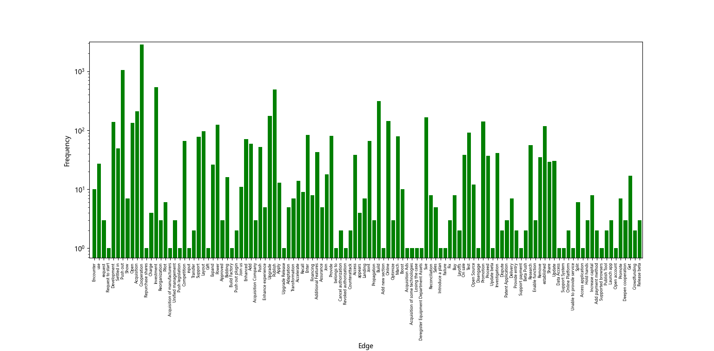

# Data Property Statistics

#### LSED is a dynamic interaction network built upon the open accessible news aiming to provide a relatively complete and accurate evolution trace of "Chinese Internet+” service ecosystem

|             Data name              |     Data value     |
| :--------------------------------: | :----------------: |
|            4-Tour count            |     3,383,710      |
|  50-percentile effective diameter  |         4          |
|  90-percentile effective diameter  |         5          |
|       Algebraic connectivity       |      0.00482       |
|   Average clustering coefficient   |       0.482        |
|           Average degree           |       3.563        |
|     Average edge multiplicity      |       1.3987       |
|        Average path length         |       3.6632       |
|      Average weighted degree       |       4.984        |
|             Claw count             |      72134011      |
|            Cross count             |     6980806791     |
|        Degree assortativity        | -0.282843847009615 |
|              Density               |       0.001        |
|              Diameter              |         12         |
|                Fill                |      0.00083       |
|          Gini coefficient          |       0.6294       |
|             Loop count             |         0          |
|           Maximum degree           |        497         |
|          Median distance           |         4          |
|             Modularity             |        0.57        |
|     Modularity with resolution     |        0.57        |
|         Power law exponent         |       2.8165       |
|               Radius               |         1          |
| Relative edge distribution entropy |       0.8376       |
|                Size                |       4,301        |
|            Size of LCC             |       3,818        |
|           Spectral norm            |      33.5678       |
|        Spectral separation         |       1.3742       |
|           Triangle count           |       4,343        |
|         Unique edge count          |       7,663        |
|               Volume               |       10,718       |
|            Wedge count             |      655,148       |

Fruchterman–Reingold graph drawing

Degree Distribution

Cumulative Degree Distribution

Lorenz Curve

Spectral Distribution Of The Adjacency Matrix

Spectral Distribution Of The Normalized Adjacency Matrix

Spectral Distribution Of The Laplacian

Degree Assortativity

In/Outdegree Scatter Plot

Edge Weight Histogram

Clustering Coefficient Distribution

Average Neighbor Degree Distribution

Temporal Distribution

Diameter/density Evolution

Inter-event Distribution

